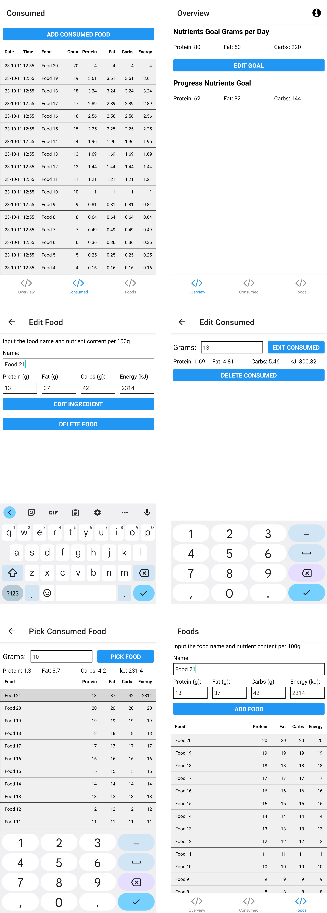

# Nutrient Tracker

<!-- TODO: add license badge -->
<!-- TODO: project descript -->

A very simple macro nutrient tracker for Android.
I wrote it for my own use because I was dissatisfied with the available apps.

It features 

# Development

Setup your environment as per the [React Native](https://reactnative.dev/docs/set-up-your-environment) docs.

```shell
 git clone git@github.com:InvisOn/Nutrient-Tracker.git
 cd Nutrient-Tracker/
 npm install
 npx expo start
```

# Build

Install [EAS CLI](https://docs.expo.dev/build/setup/). Then run `eas build --platform android`.

# Screenshots


